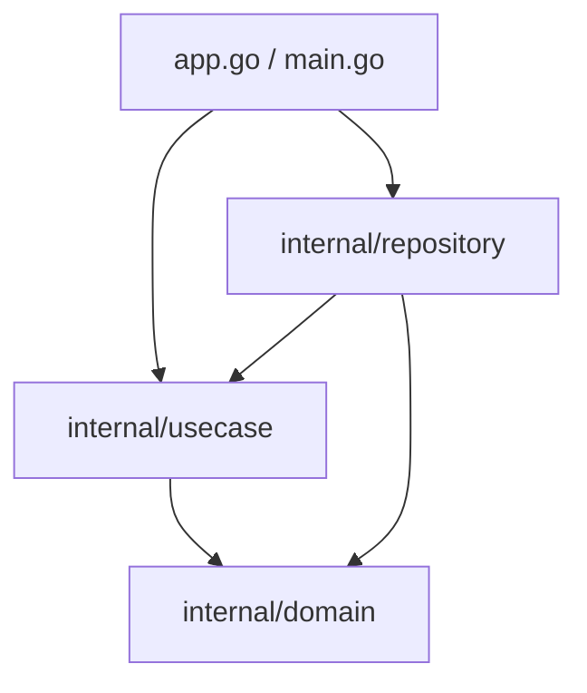

# バックエンド開発ルール (Backend Development Rules)

このドキュメントは、`codex-session-display` の Go バックエンド開発における設計原則、コーディング規約、およびテスト方針を定義します。エージェントはコードの追加や変更を行う際、常にこのルールを遵守しなければなりません。

---

## 1. アーキテクチャとレイヤー構造

バックエンドはクリーンアーキテクチャの原則に基づき、以下のレイヤーに分割されています。依存関係は内側（ドメイン）に向かってのみ流れるようにし、逆方向の依存や循環参照を禁止します。



### レイヤー定義とルール
1. **Domain (`internal/domain`)**
   - ビジネスロジックの核となるエンティティやデータ型（DTO）を定義します。
   - `internal/domain/dto` には、フロントエンドとのやり取りに使用するデータ構造体（例: `session.go` 内の `SessionSummary`）や共通エラー型を配置します。
   - 他のいかなるレイヤー（`usecase`, `repository` など）にも依存してはなりません。

2. **Usecase (`internal/usecase`)**
   - アプリケーションのユースケース（ビジネスルール）を実現するロジックを実装します。
   - **リポジトリインターフェースの定義**: 永続化層との境界となるインターフェース（例: `SessionRepository`）は、このレイヤーに定義します。
   - `domain` レイヤーにのみ依存し、具象化された `repository` に依存してはなりません。

3. **Repository (`internal/repository`)**
   - データベースやファイルシステム、キャッシュなどの外部リソースへのアクセスを具体的に実装します。
   - `internal/usecase` で定義されたリポジトリインターフェース（例: `SessionRepository`, `CacheRepository`）を実装します。
   - `domain` および `usecase` レイヤーに依存します。

4. **Utils (`internal/utils`)**
   - ロギングなどの横断的関心事（Cross-cutting concerns）を実装します。他レイヤーのビジネスロジックに依存しないようにします。

---

## 2. エラーハンドリング規約

1. **フロントエンドへのエラー返却**
   - Wailsを介してフロントエンド（App.tsxなど）に公開するメソッド（`app.go` 内のメソッド）は、エラー発生時に必ず `*dto.AppError` を返す必要があります。
   - `dto.AppError` は以下の形式で統一します。
     ```go
     appErr := &dto.AppError{
         Code:    "INTERNAL_ERROR", // もしくは具体的なエラーコード
         Message: "ユーザーフレンドリーなエラーメッセージ",
     }
     ```
2. **内部エラーの伝播**
   - パッケージ内部やユースケース層では、`fmt.Errorf("context message: %w", err)` を使用してエラーをラップし、スタックトレースやコンテキスト情報が失われないようにします。
3. **エラーログ**
   - エラーを呼び出し元に返す前に、必要に応じて `logger.Error` を呼び出してエラー内容とコンテキスト情報を記録します。

---

## 3. ロギング規約

Go標準の `log` パッケージや `slog` を直接使用することは禁止します。必ず `codex-session-display/internal/utils/logger` パッケージを使用してください。

1. **ログレベルの使い分け**
   - `Debug`: 開発時のトラブルシューティングに必要な詳細情報（関数の引数や中間処理結果など）。
   - `Info`: アプリの起動・終了、ユースケースの開始・正常終了など、システムの主要な状態変化。
   - `Warn`: データのパースエラーのスキップ（Tolerant parsingなど）や、処理は継続できるが注意が必要な事象。
   - `Error`: 主要機能の動作不能、ファイル読み込み失敗、復旧不可能なエラー。
2. **構造化ログ**
   - キー・値のペアを用いて、ログに文脈情報を持たせます。
   - 例: `logger.Info("ListSessions completed", "count", len(res))`

---

## 4. テスト方針

1. **テストファイルの配置**
   - テストコードは、テスト対象ファイルと**同じディレクトリ**に `*_test.go` として配置します（例: `session_fs.go` に対する `session_fs_test.go`）。
2. **ビルドタグの考慮**
   - アプリケーションは `production` タグによるビルド切り替え（`logger_prod.go` など）を行っているため、テスト実行時は以下の両方のコマンドで検証を行う必要があります。
     - `go test ./...`
     - `go test -tags production ./...`
3. **C0カバレッジ（命令網羅率）の担保**
   - 新規コードの追加や既存コードの変更を行う場合、**C0カバレッジ（statement coverage）**が可能な限り100%に近くなる（すべての実行文をカバーする）ようにテストコードを記述してください。
4. **堅牢なテストケース設計**
   - 正常系だけでなく、境界値や異常系（ファイルが存在しない場合、JSONのパースに失敗した場合、空のファイルの場合など）のテストを含めてください。
   - `tolerant` パース（一部の不正レコードをスキップする処理）の挙動に対するユニットテストを記述してください。

---

## 5. コード変更時の検証フロー

バックエンドコード（`*.go`）を書き換えた場合、必ずコミットやプッシュを行う前に以下の検証（Lintおよびテスト）を実行してください。

1. **リンターの実行**
   - `golangci-lint run`（または `task lint`）を実行し、コードに問題がないか確認します。
2. **テストの実行**
   - `go test ./...` および `go test -tags production ./...`（または `task test`）を実行し、すべてのテストがパスすることを確認します。
   - また、必要に応じて `task cover` を実行し、C0カバレッジが維持・向上しているかを確認します。
