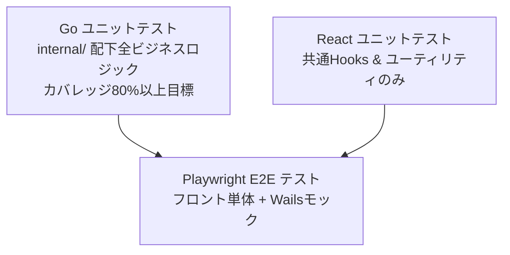

# ADR 0020: テスト戦略および各テスト手法の範囲・目標の決定

## ステータス

承認済み

## コンテキスト

Wails (Go + React) で構築されるデスクトップアプリケーション開発において、コードの品質および要件 (§3.2 性能目標等) の達成を継続的に保証するため、テスト戦略を定義する必要がある。
特に、以下の性質を持つ本アプリ特有の課題への対応が求められる：
1. Goバックエンドは Wails SDK から隔離されており、複雑なJSONLパース、`tolerant` パース、React Flow 用のグラフ変換・レイアウト計算などのコアロジックを含む。
2. フロントエンド (React) は React Flow という複雑な外部ライブラリへの依存が強く、通常のコンポーネントテスト（Vitest + React Testing Library 等）ではモックが複雑化し、テストの費用対効果が低くなりやすい。
3. デスクトップアプリ全体のE2Eテストは、OSネイティブのGUI自動化ツールが必要となり、CI環境での構築や実行の安定性を維持するのが極めて困難である。
4. テストデータの定義と管理が一貫していないと、バックエンドのテストとフロントエンドの表示テストで整合性を保つのが難しくなる。

これらを解決するための現実的かつ効果的なテストアプローチを決定する。

## 決定

本プロジェクトでは、以下のテストピラミッド方針を採用する。

### 1. Go バックエンドのユニットテスト方針
- **テスト範囲**: `internal/` 配下のすべてのビジネスロジック（`domain`, `usecase`, `repository`）を一律に対象とする。
- **カバレッジ目標**: `go test` によるカバレッジ **80%以上**。
- **重点項目**:
  - `internal/repository/session_fs.go`: 様々な形式のJSONLパース、エラー時スキップ、フォールバックの境界値検証。
  - `internal/usecase/get_session_detail.go`: React Flow用ノード・エッジの生成、階層レイアウトの座標計算。
- Wailsのライフサイクルに依存する `app.go` (Wails App本体) はユニットテストの対象外（または正常系のダミー検証のみ）とする。

### 2. React フロントエンドのユニットテスト方針
- **テスト範囲**: 状態管理カスタムフック（Debounce、展開状態管理など）および純粋な共通ユーティリティ（日付/ファイルサイズ等のフォーマット関数）に限定する。
- UIコンポーネント（特に `FlowCanvas` などの React Flow 依存部分）はユニットテストの対象から除外し、後述のE2Eテストに委ねることで、テストコードのメンテナンスコストを削減する。

### 3. E2E テスト（Playwright）方針
- **実行環境**: Vite 開発サーバー（`localhost:5173`）を起動し、ブラウザ上で Playwright を用いて実行する。
- **モックアプローチ**:
  - Wailsが自動生成するGoバインディング（`window.go` など）を、テスト実行時にPlaywrightのブラウザコンテキスト内でモック（ダミーのセッション一覧データ、セッション詳細データ）に差し替える。
  - バックエンドプロセス（Wailsバイナリ自体）は起動せず、フロントエンド単体＋Wailsモックの構成で、ユーザーインタラクション（一覧の年/月/日ツリーの折りたたみ、検索窓への入力によるDebounceフィルタリング、ノードクリック時の BottomPanel スライドイン、token_count バッジクリック時の左右分割表示）と画面遷移を検証する。

### 4. テストデータの管理方針
- **バックエンドテスト**:
  - `internal/repository/testdata/` ディレクトリ内に、検証シナリオごとの静的なテスト用JSONLファイルをコミット管理する（例: `valid-session.jsonl`, `invalid-format.jsonl`, `huge-session.jsonl`, `call-id-fallback.jsonl`, `orphan-complete.jsonl`）。
- **フロントエンドE2Eテスト**:
  - バックエンドのテストデータをパースした結果（DTO）と同一形式の静的JSONファイル（例: `session-detail-valid.json`）を `frontend/tests/mocks/` 配下に格納し、Playwrightテスト内のモックレスポンスとして使用する。これにより、テストデータの一貫性を保つ。

## 理由

1. **実用的なE2Eテストの実現**:
   - Wailsデスクトップアプリ自体のGUI操縦テストは極めて不安定でCI実行も困難だが、フロントエンド＋Wails bindingsのモックによるPlaywrightテストとすることで、安定したブラウザテスト環境で主要なUIシナリオを網羅できる。
2. **テストコストの最適化（費用対効果）**:
   - React Flowを含むコンポーネントテストを JSDOM (Testing Library) で行うのはモックの手間に対して価値が低い。UIの振る舞い検証を Playwright に寄せ、Reactユニットテストは純粋なHooksやユーティリティに絞り込むことで、メンテナンスコストを抑えつつ十分な信頼性を確保する。
3. **バックエンドの堅牢性担保**:
   - ファイルパースやレイアウト計算といったコアロジックを `internal/` 以下に完全に分離（ADR 0011）したため、標準の `go test` で高速かつ容易にカバレッジ80%以上を達成できる。

## 検討した代替案

| 代替案 | 内容 | 採用見送りの理由 |
| :--- | :--- | :--- |
| **Wails標準テストによるGUI自動化** | ビルドされたWailsアプリを操作してE2Eテストを実行する。 | テスト実行環境（Mac/Windowsの仮想マシン）の準備が非常に複雑で、ローカル実行でも実行速度が遅く、かつテストが壊れやすいため。 |
| **Reactコンポーネントテストの網羅** | Vitest + React Testing Library ですべてのUIコンポーネントのテストを書く。 | React Flow や Recharts などのインタラクティブな描画ライブラリを仮想DOM (JSDOM) 上で再現してモック化・テストするコストが大きすぎるため。 |
| **テストデータの動的生成** | テストケースごとにコード内で文字列やオブジェクトを組み立てる。 | 複雑なJSONL構造の文字列組み立てがテストコード内に散乱し、テストデータの再利用性や可読性が低下するため。静的ファイルを配置する方が見通しが良い。 |
